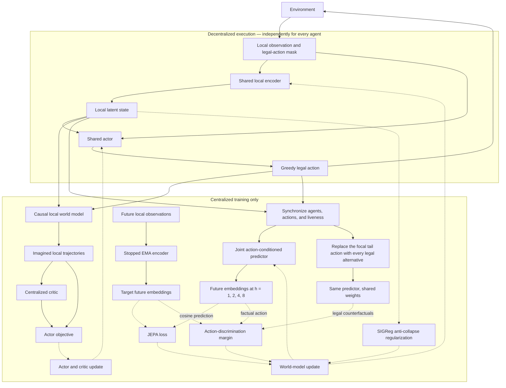

# MA-JEPA

MA-JEPA is a decoder-free joint-embedding predictive world model for
cooperative multi-agent reinforcement learning. This repository contains the
single architecture used in the paper: stopped EMA cosine targets, a
joint-action-conditioned CTDE world model, all-legal action discrimination, a
centralized critic, and shared decentralized actors.

## How it works



The encoder learns predictive rather than reconstructive features: its online
prediction must match a stopped EMA target by cosine similarity. The
all-legal margin additionally requires the factual action to predict that
target better than every other legal focal-agent action at the intervened
future step, making the latent dynamics sensitive to control. SIGReg preserves
representation diversity.
The joint predictor and centralized critic are training-only; execution keeps
only the shared encoder, local state, legal-action mask, and shared actor.

## Setup

```bash
git submodule update --init --recursive
uv sync --python 3.11 --extra dev --extra smac --extra cuda12
export SC2PATH=/path/to/StarCraftII
```

## Train

```bash
uv run majepa-train \
  --task smac_3m \
  --num-agents 3 \
  --seed 0 \
  --total-env-steps 50000 \
  --eval-interval 1000 \
  --eval-episodes 16 \
  --eval-envs 4
```

The command always resolves `smac_vector + ma_jepa`; there is no public
architecture or ablation selector.

Use `--train-envs` to collect from multiple copies of the same task in parallel:

```bash
uv run majepa-train \
  --task smac_3m \
  --num-agents 3 \
  --train-envs 16 \
  --total-env-steps 50000
```

Each copy runs in its own process with seed `seed + worker_index`. Policy
inference is batched, while recurrent state, resets, and replay sequences stay
separate for each environment. All workers feed one learner and replay store.
`--train-envs` defaults to 1; `--eval-envs` controls evaluation separately.

The total budget is shared across training environments, so 16 workers split
50,000 steps rather than each collecting 50,000. The environment clock
includes reset observations. Collection stops exactly at the budget: when the
last batch is uneven, only the required workers take another step. For example,
43 records across three environments split as 15, 14, and 14. More workers need
more CPU and memory.

Replay prefill is 10% of the total collection budget, rounded up and included in
that budget. A 50,000-record run collects at least 5,000 records before any
learner updates. Replay must also contain enough complete sequences to form
training batches, and actor–critic learning retains its configured start step.
Prefill does not accumulate a backlog of learner updates.

## Evaluate

```bash
uv run majepa-evaluate runs/majepa/smac_3m/seed_0/<run> \
  --episodes 128 \
  --envs 4 \
  --eval-seed 100000
```

## Layout

```text
src/majepa/agent.py       local world model and decentralized actor
src/majepa/marl/          synchronized CTDE training
src/majepa/models/        predictive models and centralized critic
src/majepa/training/      objectives and optimization
src/majepa/envs/          environment adapters
src/majepa/configs.yaml   locked architecture and runtime defaults
tests/                    focused correctness tests
```

## Check

```bash
uv run pytest -q
uv run ruff check .
uv run ruff format --check .
```

## License

MIT. See [LICENSE](LICENSE) and [NOTICE.md](NOTICE.md).
