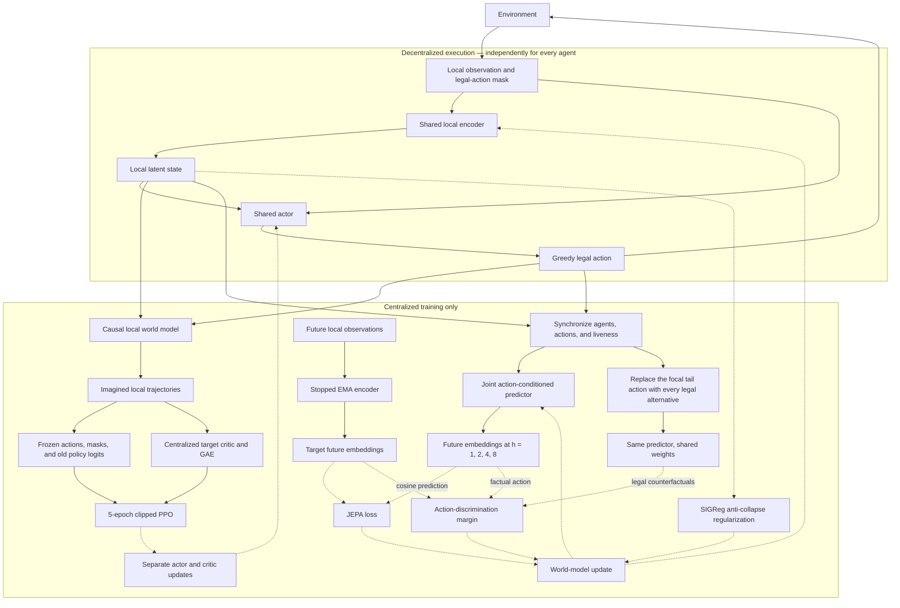

# MA-JEPA

MA-JEPA is a decoder-free joint-embedding predictive world model for
cooperative multi-agent reinforcement learning. This repository contains the
single architecture used in the paper: stopped EMA cosine targets, a
joint-action-conditioned CTDE world model, all-legal action discrimination, a
centralized critic, and shared decentralized actors.

## How it works



The encoder learns predictive rather than reconstructive features: its online
prediction must match a stopped EMA target by cosine similarity. The
all-legal margin additionally requires the factual action to predict that
target better than every other legal focal-agent action at the intervened
future step, making the latent dynamics sensitive to control. SIGReg preserves
representation diversity.
The joint predictor and centralized critic are training-only; execution keeps
only the shared encoder, local state, legal-action mask, and shared actor.
Each learner batch updates the world model first, then creates one detached
JEPA imagination. PPO reuses that immutable batch for five clipped actor and
critic epochs. Per-agent presence and controllability mask dead-agent actions
and terminate their value bootstrap without ending the rest of the team rollout.

## Setup

```bash
git submodule update --init --recursive
uv sync --python 3.11 --extra dev --extra smac --extra cuda12
export SC2PATH=/path/to/StarCraftII
```

## Train

```bash
uv run majepa-train \
  --task smac_3m \
  --num-agents 3 \
  --seed 0 \
  --total-env-steps 50000 \
  --eval-interval 1000 \
  --eval-episodes 16 \
  --eval-envs 4
```

The command always resolves `smac_vector + ma_jepa`; there is no public
architecture or ablation selector.

## Evaluate

```bash
uv run majepa-evaluate runs/majepa/smac_3m/seed_0/<run> \
  --episodes 128 \
  --envs 4 \
  --eval-seed 100000
```

## Layout

```text
src/majepa/agent.py       local world model and decentralized actor
src/majepa/marl/          synchronized CTDE training
src/majepa/models/        predictive models and centralized critic
src/majepa/training/      objectives and optimization
src/majepa/envs/          environment adapters
src/majepa/configs.yaml   locked architecture and runtime defaults
tests/                    focused correctness tests
```

## Check

```bash
uv run pytest -q
uv run ruff check .
uv run ruff format --check .
```

## License

MIT. See [LICENSE](LICENSE) and [NOTICE.md](NOTICE.md).
