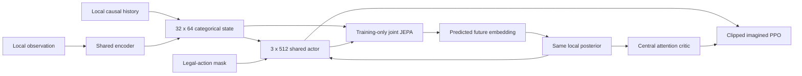

# MA-JEPA baseline architecture

Each agent owns a local observation history and recurrent cache; model parameters
are shared across agents. The actor never receives teammate observations. The
joint predictor and centralized critic are used only during training.

The local history model has deterministic width 4096, hidden/model width 512,
two temporal layers, eight heads, and context 64. Its stochastic state contains
32 categorical variables with 64 classes. The online encoder predicts stopped
EMA targets using cosine losses and SIGReg; there is no observation decoder.

The joint JEPA predictor uses two agent-attention layers and 12 temporal layers
at width 256. It predicts future local embeddings conditioned on joint actions.
Direct multi-step JEPA supervises horizons 1, 2, 4, and 8, including the retained
all-legal action-margin objective. Self-fed training uses horizons 2, 4, and 5,
eight anchors, and BPTT2. Local reward and continuation heads are absent; joint
heads provide imagined reward and continuation. The local availability head
supplies imagined masks, while the joint availability head remains supervised.

PPO generates five-step imagined trajectories after each world-model update.
The actor and critic each receive five optimization passes with clipping 0.2,
lambda 0.95, and fixed entropy coefficient 0.003. The actor uses only local
features. The critic attends over synchronized stopped local posterior states.

Replay stores 250k records. World-model and behavior-root batches are drawn
independently; each mixes 50% uniform samples with 50% samples from an age decay
of 0.9998. Snapshot-staggered sampling starts after a 5k prefill and primes four
behavior starts before the first learner read. This is the fixed4 protocol.
