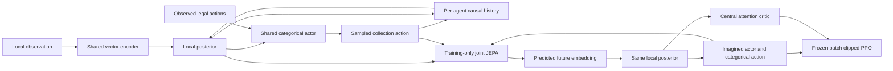

# Maintained architecture

Each agent has its own local observation history and recurrent cache. Parameters
are shared across agents, while states are separate. Neither the executable
actor nor its encoder receives privileged teammate states. The joint simulator
and attention critic combine synchronized agent features only during training.
SMAC's consistent observation/action slots are preserved.

## World model

The vector encoder is a 3 × 1024 RMSNorm/SiLU MLP with symlog inputs. The local
history transformer has width 512, two layers, eight heads, and context 64. Its
output projects to a deterministic state of 4096 (2048 in the smaller profile).
The stochastic state has 32 categorical variables with 64 classes. The latent
uniform mixture remains 0.01; it is distinct from policy uniform mixing, which
is zero.

A joint predictor combines agent features and joint actions using two agent
attention layers and a 12-layer temporal transformer (width 256, four heads,
context 16, dropout 0.1). It predicts the next local observation embedding. The
same local posterior used on real observations consumes that predicted embedding
during imagination. This is the maintained interface; there is no separate
joint categorical predictor or teammate-belief adapter.

Training combines cosine prediction of stopped EMA encoder targets, local
prior/posterior KL, SIGReg on embeddings, outcome prediction, and the following
joint objectives:

- Dense posterior alignment, weight 0.05, directly compares the posterior induced
  by a predicted embedding to the stopped factual posterior. This supervises the
  stochastic distribution the actor consumes, in addition to embedding cosine.
- Action-conditioned embedding prediction at horizons 1, 2, 4, 8, with an
  all-legal focal-action margin (margin 0.1, loss weight 0.1).
- Self-fed trajectory learning at horizons 2, 4, 5, with two-step truncated BPTT,
  eight anchors, weight 0.1 and an inner posterior-KL weight of 0.1. This trains
  the joint model through its own predictions, with local model parameters frozen.

The local history and predictor dimensions are independent: “WM4096” names the
local deterministic state width, not the attention width or total parameter
count. On `3s_vs_4z`, the reference has 34,562,824 trainable local-world parameters
and 18,765,068 joint-world parameters: **53,327,892 trainable WM parameters**.
EMA copies and optimizer state are excluded. These counts vary slightly by map.

## Imagined PPO

One world-model update is followed by a newly generated, detached imagination
batch. Each root uses recorded history and a true initial legal-action mask.
Later availability masks are independently Bernoulli-sampled from predicted
probabilities, then combined with predicted liveness. Empty support has a no-op
fallback. The actor samples from the masked categorical distribution; the sampled
masks, actions, features, old logits, and advantages stay fixed across PPO passes.

The policy is a 3 × 512 MLP. The centralized critic uses width-256 attention,
two attention layers, a 2 × 256 value MLP, and a 255-bin symexp/two-hot output.
The former generic `value.units` field did not size this critic and was removed.
Reference parameter counts on `3s_vs_4z` are 3,678,218 actor and 3,350,271 critic.

PPO uses five actor passes and five critic passes, categorical likelihood-ratio
clipping at 0.2, lambda 0.95, and fixed entropy coefficient 0.003. There is no
policy or collection uniform mixture. The actor receives no pathwise world-model
gradient: BPTT describes representation learning, not a replacement for PPO.
The critic uses two-hot cross entropy, not a clipped squared-value objective.

The default imagination length is 5. Discount is `1 - 1/333`, with learned
continuation. Value targets preserve the team's future rewards after an
individual agent dies. The additional replay value objective (weight 0.3) uses
recorded rewards and boundaries, but ordinarily bootstraps from imagined root
returns. It is **not** the rejected factual successor-state/V-trace treatment.
Time-limit boundaries use target-critic values on the recorded state.

Local and joint world models have separate optimizers, each at `1e-4` in the
reference. Actor and critic each use `3e-5`. The implementation applies adaptive
gradient clipping (0.3), RMS scaling and momentum, with no optimizer warmup.
Target encoder EMA uses update fraction 0.01 every learner update. The target
critic copies fully at each active PPO update. These are separate mechanisms.

## Data and measurement

The world-model replay view samples 50% uniformly and 50% with recency weighting
(decay 0.9998). A separate uniform behavior view supplies imagination starts.
Replay contains up to 250k records; learner batches have 16 sequences with a
192-step history prefix and 64-step training suffix. Behavior histories are
reconstructed under current parameters, as in the deployed implementation.
This is distinct from the removed additional fresh-history treatment inside
self-fed trajectory training.

Training-only metrics include genuine post-update PPO KL and clipping, latent
and posterior prediction losses, SIGReg spread, and availability calibration and
support errors. They are useful checks, but not an independent validation set:
replay distributions evolve with the policy. In particular, high embedding
cosine or critic explained variance is not proof of correct action ranking.
